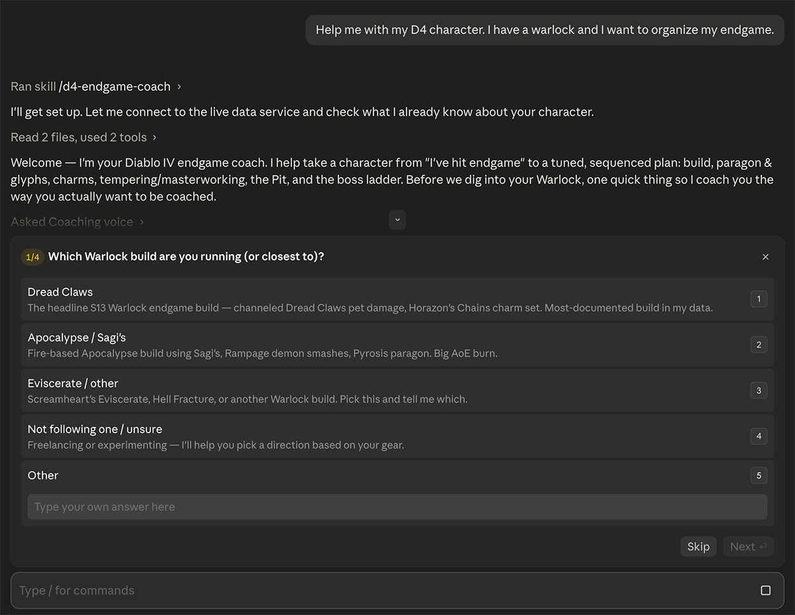
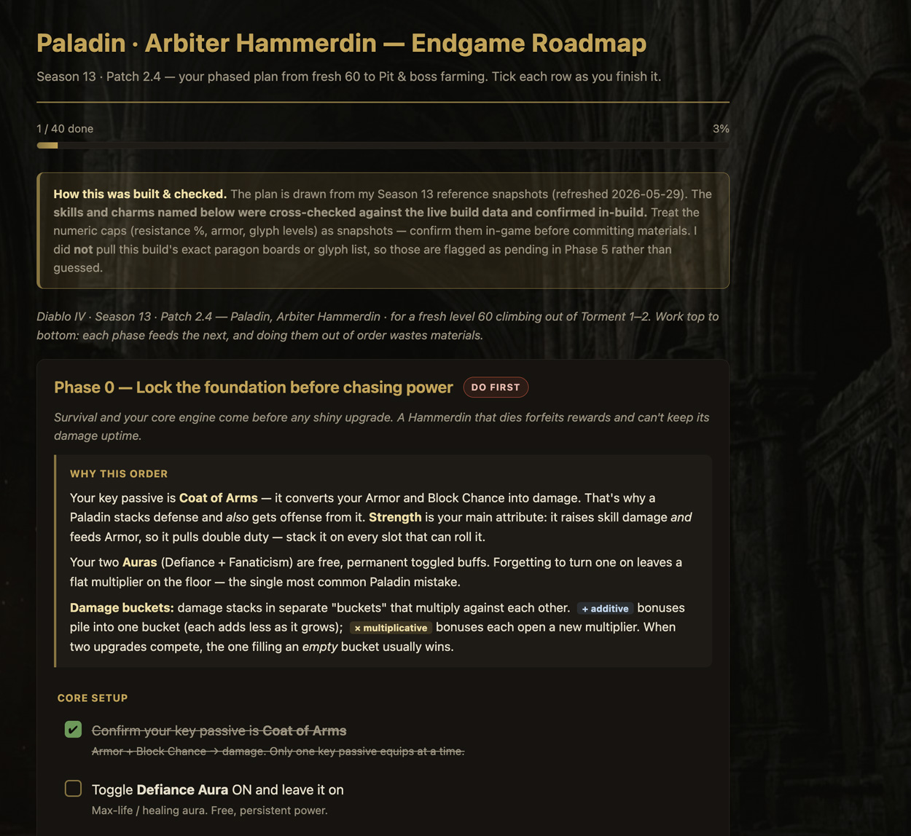
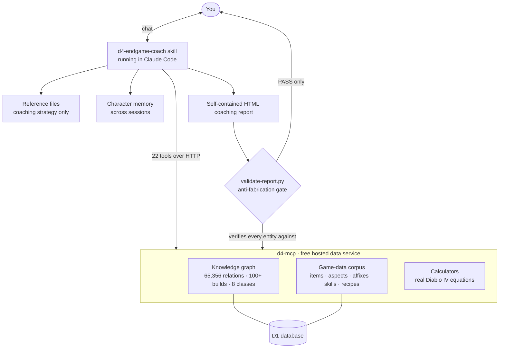

# claude-d4-coach

**Turn any Claude Code session into an expert Diablo IV endgame coach.**
**v0.4 — Season 13 / Patch 2.4.**

Open a chat, say *"help me with my D4 character"* or *"I'm stuck at Pit 80"*, and a coach activates that knows every class, system, and endgame loop in the current season. It picks a coaching voice with you, runs the math you'd otherwise do in a spreadsheet, and renders your plan as a checkable page you keep open beside the game. Every loadout fact it states is pulled live from a game-data service and machine-checked before you see it — so it coaches from actual data, not from what a language model "remembers."

---

## The experience

It starts a real coaching conversation — introduces itself, lets you pick how it talks to you, and asks what it needs with click-to-answer questions instead of a wall of text:



When the answer is a plan worth tracking, it doesn't dump scrollback — it builds a self-contained HTML roadmap with your specific targets, working checkboxes, and a progress bar:



**See a real one:** [`examples/arbiter-paladin-endgame-roadmap.html`](examples/arbiter-paladin-endgame-roadmap.html) — download it and open it in a browser. Every gear slot, charm, and skill is its own checkable row; the background and styling are embedded, so it works offline with nothing to install. This is what the coach produces for a fresh-endgame Arbiter Paladin.

## What it does

- **Knows all 8 classes** for the current season — Barbarian, Rogue, Sorcerer, Druid, Necromancer, Spiritborn, Paladin, Warlock — including the seasonal Charm + Seal power system.
- **Reviews your actual build**, slot by slot, against live data — gear, aspects, paragon, glyphs, tempers, masterwork priorities. Tell it what you're running and it checks it; it never guesses a loadout from memory.
- **Runs exact math, not estimates.** DPS in the multiplicative-bucket model, armor breakpoints, glyph XP timing, Horadric recipe costs, and head-to-head "which upgrade wins" — computed deterministically.
- **Coaches the full endgame loop.** Pit pushing, Nightmare Dungeons, Helltide farming, the boss ladder, mercenaries, gems & runes, tempering, masterworking, the Horadric Cube.
- **Explains itself.** No naked jargon — it tells you what "replicate," "temper," "masterwork ranks," and damage buckets actually mean as it uses them.
- **Remembers your character** between sessions, in your chosen coaching voice, so you never re-explain your setup.

## Why you can trust the numbers

A coaching report that mixes real and made-up stats is worse than useless. This harness fights that two ways: the **knowledge graph is the single source of every loadout fact** (the reference files contain coaching strategy only — no gear tables that can drift), and a bundled **validator checks every named item, aspect, board, and skill in a generated report against the live data** before it's shown to you. If something can't be verified, it's flagged, not shipped.

## Architecture at a glance



**The loop that keeps it honest:** the coach pulls facts from `d4-mcp`, writes a report, and the validator checks every entity in that report back against the same service before you ever see it.

## What it doesn't do

- Play the game for you, read your screen, or touch your game files — coaching only.
- Replace official patch notes — always verify season-specific numbers in-game; the meta drifts every patch.
- PvP, trading, or marketplace pricing — endgame PvE optimization only.

## Requirements

- **[Claude Code](https://docs.anthropic.com/en/docs/claude-code)** installed (the `claude` CLI). That's it — the data service is already wired in (see below).

## Install

```bash
git clone https://github.com/Anashel-RPG/claude-d4-coach.git
cd claude-d4-coach
claude
```

Claude Code auto-loads the skill in `.claude/skills/d4-endgame-coach/`. Say *"help me with my D4 character"* and the coach runs a short intake, then gets to work. Try:

- *"Review my Hammerdin — I'm stuck at Pit 80."*
- *"What should I upgrade next on my Dread Claws Warlock?"*
- *"Build me a checklist to finish my charms and seal."*

## The data service (`d4-mcp`) — free, and already wired in

`d4-mcp` is the live backend that makes the coaching *factual*. It's a hosted service at `https://mcp-d4.anashel.com/mcp` exposing **22 tools across three layers:**

**1 · Game-data corpus — extracted from Diablo IV's own game files.**
Exact, current values, not estimates: **389 unique/legendary items** with their real legendary-affix text and roll ranges, **416 affixes**, **2,845 resolved item-affix tooltips**, **234 skills**, **600+ aspect effects** (real tooltip text with the numbers resolved), and **85 Horadric recipes**. When the coach says *"Herald's Morningstar gives 80–100% Blessed Hammer damage,"* that figure came from the game files — not from a model's memory.

**2 · Knowledge graph — how it all fits together.**
A **65,356-relation** graph built from **100+ current-season endgame builds across all 8 classes**, linking builds → gear → aspects → skills → paragon → charms through 20 relationship types (`REQUIRES`, `SLOTS_IN`, `SYNERGIZES_WITH`, …). This is what lets the coach pull a build's *actual* loadout — with its variants — instead of guessing one.

**3 · Calculators — Diablo IV's real equations, run deterministically.** Not rules of thumb — the math runs on real game values:

- `compute_dps` — effective damage in D4's real bucket model (additive pool × each independent multiplier × crit × Vulnerable); surfaces the bucket that's holding you back
- `armor_breakpoint` — armor needed for a target damage-reduction %, via the real curve `DR = armor / (armor + K)`
- `glyph_xp_time` — Nightmare-Dungeon / Pit runs to level a glyph
- `recipe_cost` — total materials for a Horadric Cube recipe
- `bucket_compare` — which of two upgrades adds more *effective* damage

Season-tuned constants (armor K-value, recipe costs) are approximations the tools flag for you to confirm in-game.

**The coach is wired to *use* these, not just to have them** — it's instructed when to reach for each (graph before asserting a loadout, a lookup before classifying an aspect, `compute_dps` past a couple of multipliers, `bucket_compare` for head-to-head upgrades). **→ Full catalog of all 22 tools, by layer, with what each returns: [`docs/TOOLS.md`](docs/TOOLS.md).**

**You don't set anything up.** This repo ships an `.mcp.json` that already includes a **public, read-only access key**, so a fresh clone connects on first run:

- **No account, no signup, no OAuth click, no key to request.** Clone, open Claude Code, and the tools are live.
- The key ships under a custom `X-D4-Public-Key` header. It is **public by design** — read-only, rate-limited per client, and reaches only game data plus the pure-math calculators. It is not a credential and is meant to be committed and shared. (The header is custom precisely so it doesn't trip secret scanners.)
- If the service is ever unreachable, the coach **still works** from its bundled season reference files — you just lose the live, exact numbers until it's back, and any unverified figure is labeled as a snapshot.

### Why it's free, and an honest heads-up

This is a personal project. The service costs very little to run, so it's offered openly to anyone using the coach — **I (the maintainer) currently pay for it out of pocket.**

> ⚠️ **No guarantees.** The public endpoint may be rate-limited, changed, or shut down at any time — it depends on me continuing to foot the bill. For now it's up and open. If it ever goes away, the coach degrades gracefully to its bundled data, and you're free to point `.mcp.json` at your own host.

## Disclaimer

Best-effort personal project. D4's meta drifts every patch — if a number looks off, tell the coach and it will re-check against the live data and flag the season any number applies to.

Not affiliated with Blizzard Entertainment. Diablo IV is a trademark of Blizzard Entertainment, Inc.

## License

MIT. See [`LICENSE`](LICENSE).
